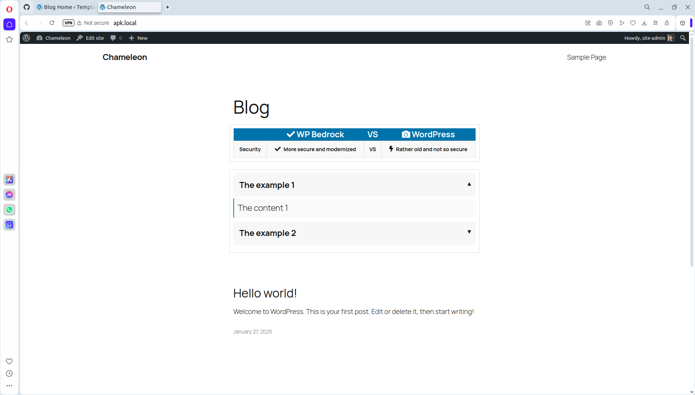
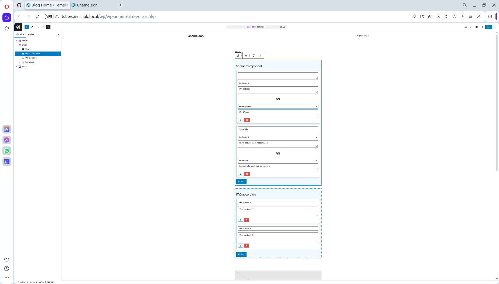

# TwentyTwentyFive Child Theme with custom blocks for Gutenberg

This repository contains the definition of a **TwentyTwentyFive Child Theme** with various custom **Accordion/Versus Blocks** for the **Gutenberg Editor**. It is designed for **WordPress 6.7.1** running on **WP Bedrock**.

---

## Features

- **Custom Accordion/Versus Blocks**:
  - Built specifically for the Gutenberg Editor.
  - Fully customizable with multiple items.
  - Smooth animations for opening/closing.
  - Visual indicators for open/closed states.
  - Supports SCSS styling and clean JavaScript functionality.

- **Child Theme**:
  - Extends the functionality of the TwentyTwentyFive theme.
  - Optimized for modern WordPress development with Bedrock.

---

## Technical Details

- **WordPress Version**: 6.7.1
- **PHP Version**: Tested with PHP 8.3
- **Technology Stack**:
  - **WP Bedrock**: Structured WordPress setup for advanced workflows.
  - **SCSS**: Modular and maintainable styling.
  - **JavaScript**: Custom scripts for Gutenberg editor interaction.
  - **Webpack**: Used for asset management (CSS/JS compilation and copying).

---

## About the Author

Created by **Peter Novozhilov** to demonstrate:

- Expertise in **WordPress Bedrock development**.
- Advanced **PHP coding** skills.
- Ability to work with **Gutenberg blocks** and the **Gutenberg editor**.
- Knowledge of **JavaScript** and **SCSS** workflows for modern web development.

---

## Screenshots

### Frontend View:
  
View full-size: [screenshot.png](./screenshot.png)

### Admin Editor View:
  
View full-size: [screenshot-admin.png](./screenshot-admin.png)

